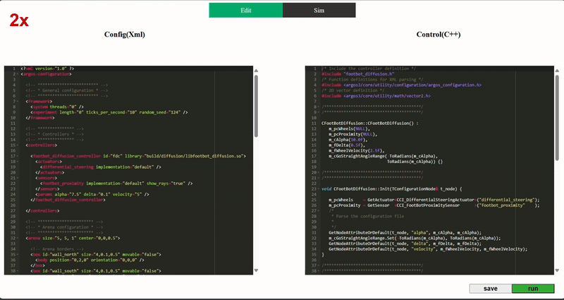
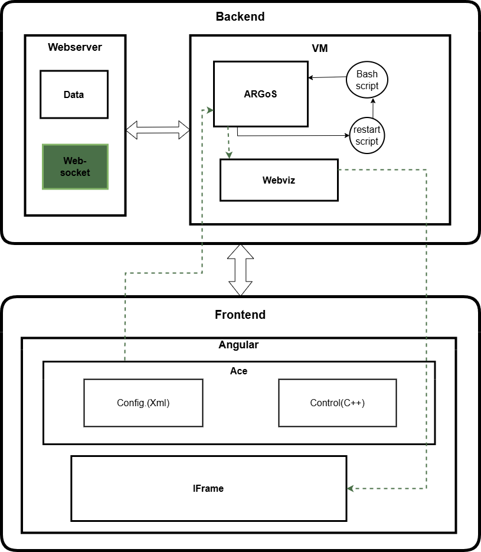

# Realtime Collaborative Robotic Simulation Tool

This project is part of my bachelor thesis and includes a prototype named "CollabSim". It is a web application enabling real-time collaboration on configuration and control files for the [ARGoS simulation](https://www.argos-sim.info/). It allows multiple clients to collaborate using a shared code editor and visualize simulation results immediately through an embedded web interface.

## Features

- **Real-Time Collaboration**: Multiple clients can work simultaneously on ARGoS files using WebSockets for synchronization.
- **Integrated Code Editor**: A interface powered by [Ace Editor](https://ace.c9.io/) to edit XML configuration files and C++ control code.
- **Live Updates with Embedded Visualization**: The simulation output, generated via the [WebViz plugin](https://github.com/NESTLab/argos3-webviz), is directly displayed in an iframe within the frontend.
- **Dynamic Interaction**: Save code changes to see them immediately reflected in the simulation.
- **Seamless Integration**: Backend connects the Angular frontend with the Ubuntu VM to manage simulation execution and track any file changes.

---
## System Architecture

The architecture consists of three major components:

1. **Frontend (Angular)**:
   - **Ace Editor** for editing:
     - Configuration files (`XML`).
     - Control code (`C++`).
   - Embedded **iframe** for simulation visualization.
   - Connects with the backend using WebSockets.

2. **Backend (Flask)**:
   - Acts as a bridge between the frontend and the Ubuntu VM.
   - Manages file saving and triggers commands to run ARGoS in the VM.

3. **Ubuntu VM**:
   - Runs ARGoS simulations.
   - Includes:
     - ARGoS simulation engine.
     - WebViz plugin for visualizing simulations.
   - Uses a Bash scripts and a flask server for simulation control (restart).

